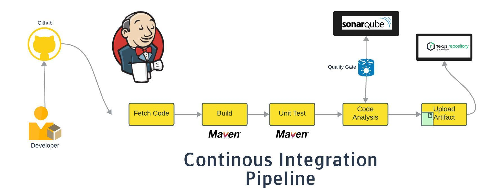

## General info
This project aims to streamline the development and continuous integration process by automating the code commit and build processes using Jenkins and GitHub. Developers can make code changes locally and, upon verification, push them to a centralized GitHub repository.

## Workflow
* ## Code Commit and Jenkins Trigger
  - Developers write, test, and commit code changes locally.
  - Jenkins, configured with the Git tool and Git plugin, automatically detects changes in the GitHub repository.

* ## Code Build with Maven
  - Jenkins fetches the updated code and triggers a build using Maven.
  - The build process utilizes Maven as the build tool, given the Java codebase.

* ## Unit Testing
  - Maven incorporates a unit testing framework, allowing developers to perform unit tests as part of the source code.
  - Unit test reports are generated for further analysis.

* ## Code Analysis with SonarQube
  - The code undergoes a comprehensive analysis using SonarQube and Checkstyle.
  - Reports are generated to identify vulnerabilities and adherence to coding practices.

* ## Quality Gates
  - A quality gate is set in SonarQube to determine if the code meets predefined standards.
  - The build fails if the code does not pass the quality gate, preventing further pipeline execution.

* ## Artifact Versioning and Nexus Repository
  - Upon a successful build and analysis, artifacts are generated.
  - Artifacts are versioned and uploaded to the Nexus Sonatype repository for centralized storage.

## Deployment
  - Verified artifacts can now be distributed and deployed on servers.
  - This robust pipeline ensures code quality, security, and seamless deployment by automating key development and integration steps.
